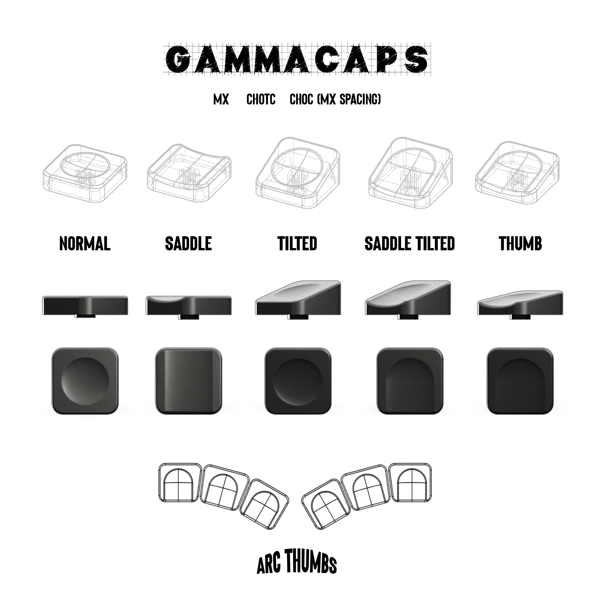

# GammaCaps — Keycaps for MX & Kailh Choc Switches

## Types of Keycaps:
| Variant                   | Description                                                                                  |
| :------------------------ | :------------------------------------------------------------------------------------------- |
| **Normal**                | Flat profile. Includes 1u, 1.25u, 1.5u, and 2u versions.                                         |
| **Tilted**                | Same as Normal, but the top profile is tilted at 15°.                                        |
| **Thumb**                 | Lower than Normal, with a cut on the downward side. Also includes 90° versions for keyboards with a rotated last thumb key. |
| **Arc Thumb**             | Designed for keyboards with thumb keys rotated by 15° each (e.g., Corne, DAO).              |
| **Saddle**                | Similar to Normal, but the top profile features two symmetrical cuts.                         |
| **Saddle Tilted**         | A tilted version of the Saddle keycap with one cut.                                          |
| **Normal/Saddle Homing**  | Features two small bumps to help determine the home position.                                |

## Contacts:
Telegram: [@grygree](https://t.me/grygree)
